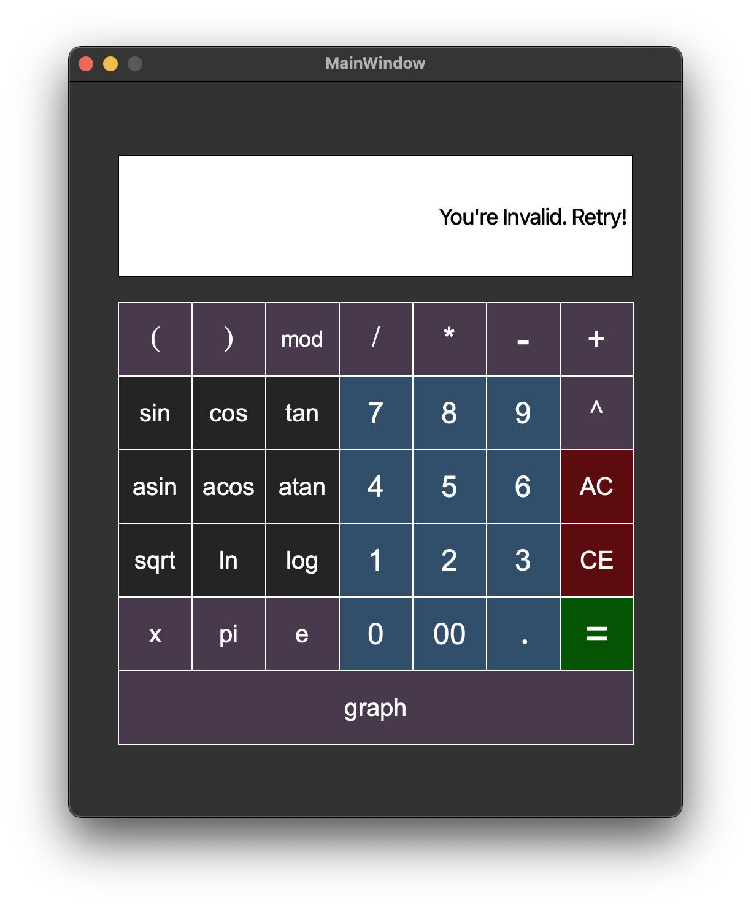

# Calculator

Implementation of the standard calculator, which can be found in the standard applications of each operating system, in C++ in the object-oriented programming paradigm. In addition to basic arithmetic operations such as add/subtract and multiply/divide, supplemented the calculator with the ability to calculate arithmetic expressions by following the order, as well as some mathematical functions (sine, cosine, logarithm, etc.). It also supports the use of the x variable and the graphing of the corresponding function. The calculator has ability to calculate arithmetic expressions by following the order, as well as some mathematical functions (sine, cosine, logarithm, etc.). At last it supports using of the _x_ variable and graphing of the corresponding function.

## Implementation of Calculator

- The program developed in C++ language of C++17 standard
- Writing code follows the Google style
- Prepared full coverage of expression calculation modules with unit-tests using the GTest library
- The program built with Makefile which contains standard set of targets for GNU-programs: all, install, uninstall, clean, dvi, dist, tests
- GUI implementation based on **Qt**
- The program implemented using the MVC pattern, and also:
   - there no business logic code in the view code
   - there no interface code in the controller and the model
   - controllers thin
- Both integers and real numbers with a dot can be input into the program. Provided the input of numbers in exponential notation
- The calculation done after you complete entering the calculating expression and press the `=` symbol.
- Calculating arbitrary bracketed arithmetic expressions in infix notation
- Calculate arbitrary bracketed arithmetic expressions in infix notation with substitution of the value of the variable _x_ as a number
- Plotting a graph of a function given by an expression in infix notation with the variable _x_ (with coordinate axes, mark of the used scale and an adaptive grid)
   - It is not necessary to provide the user with the ability to change the scale
- Domain and codomain of a function are limited to at least numbers from -1000000 to 1000000
   - To plot a graph of a function it is necessary to additionally specify the displayed domain and codomain
- Verifiable accuracy of the fractional part is at least to 7 decimal places
- Functions:
	| Function description | Function |
	| ------ | ------ |
	| Computes cosine | cos(x) |
	| Computes sine | sin(x) |
	| Computes tangent | tan(x) |
	| Computes arc cosine | acos(x) |
	| Computes arc sine | asin(x) |
	| Computes arc tangent | atan(x) |
	| Computes square root | sqrt(x) |
	| Computes natural logarithm | ln(x) |
	| Computes common logarithm | log(x) |
